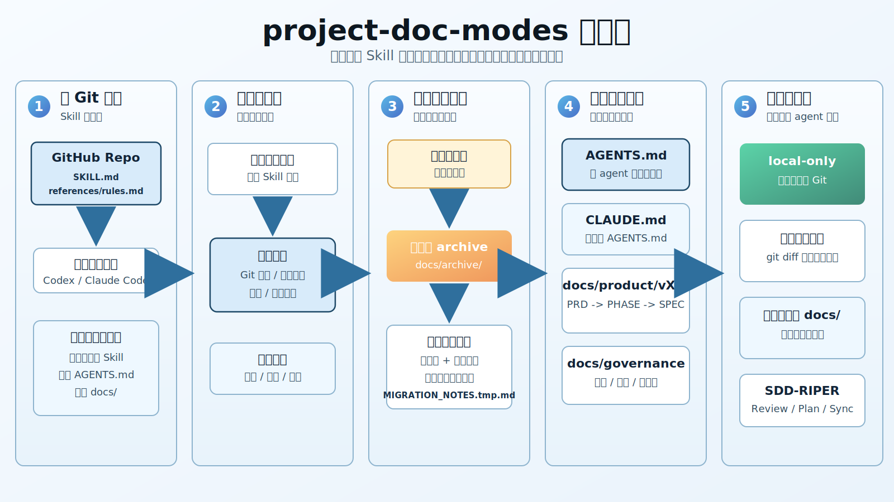

# project-doc-modes

`project-doc-modes` 是一个 Markdown-first 的文档治理 Skill，用来在目标项目中建立可持续的文档结构、版本治理和 SDD-RIPER 工作流。

## 配图



## 安装

安装请使用 `install.md`。它会把仓库内的 `project-doc-modes/` 干净 Skill 包安装到 Codex / Claude Code 的默认 Skill 文件夹。

推荐让 AI 助手执行：

```text
Fetch and follow instructions from https://raw.githubusercontent.com/verycafe/project-doc-modes/main/install.md
```

Hook 绑定是单独入口，默认只绑定当前项目：

```text
Fetch and follow instructions from https://raw.githubusercontent.com/verycafe/project-doc-modes/main/hooks.md
```

全局绑定必须由用户显式改参数：

```text
Fetch and follow instructions from https://raw.githubusercontent.com/verycafe/project-doc-modes/main/hooks.md with scope=global
```

默认 Skill 文件夹是：

```text
Codex:      ${CODEX_HOME:-$HOME/.codex}/skills/project-doc-modes
Claude Code: ${CLAUDE_HOME:-$HOME/.claude}/skills/project-doc-modes
```

不要把整个仓库直接 clone 成最终 Skill 文件夹。最终 Skill 文件夹里只应该保留 `project-doc-modes/` 子目录中的运行时文件。

手动安装命令也在 `install.md` 中维护，README 不重复展开，避免安装入口分叉。

安装完成后，运行时 Skill 目录只包含：

```text
SKILL.md
references/rules.md
```

Claude Code 安装还会生成用户级命令包装：

```text
$CLAUDE_HOME/commands/project-doc-modes.md
$CLAUDE_HOME/commands/project-doc-modes-sdd.md
$CLAUDE_HOME/commands/project-doc-modes-sync.md
$CLAUDE_HOME/commands/project-doc-modes-verify.md
```

`scripts/install_runtime.py` 是安装和同步脚本，只负责把 `project-doc-modes/` 子目录安装成最小运行时 payload、生成 Claude Code 命令包装、清理旧安装残留和运行自测。它不会在用户的目标项目里生成文档。

仓库结构：

```text
.gitignore
install.md
hooks.md
README.md
assets/project-doc-modes-workflow.svg
project-doc-modes/SKILL.md
project-doc-modes/references/rules.md
scripts/install_runtime.py
```

## 使用

在目标项目中使用。

Codex：

1. 打开目标项目。
2. 激活 `project-doc-modes` Skill。
3. 用自然语言说明要初始化、迁移、整理文档，或启用 SDD-RIPER。

Claude Code：

1. 进入目标项目。
2. 调用已安装的 Skill；如果已生成命令包装，也可以使用：

```text
/project-doc-modes
```

初始化完成后，如果需要把单次会话、Hook payload、代码变更摘要和验证输出增量同步回文档，可以使用：

```text
/project-doc-modes-sync
```

只做结构检查、不改文档时，可以使用：

```text
/project-doc-modes-verify
```

如需启用 SDD-RIPER / 团队氛围编码治理，且已生成 Claude Code 命令包装，可以使用：

```text
/project-doc-modes-sdd
```

执行初始化或迁移时，Skill 会先检查目标项目，再用少量问题确认模式、语言、版本、阶段或角色边界，然后才创建或迁移文档。`sync` 不提问、不重建结构；`verify` 默认只读。

## 项目结构

初始化后的目标项目文档结构通常是：

```text
.
├── AGENTS.md
├── CLAUDE.md
├── README.md
└── docs/
    ├── README.md
    ├── archive/
    ├── governance/
    │   ├── STATUS.md
    │   ├── WORKFLOW.md
    │   ├── RELEASES.md
    │   └── context/
    │       ├── CODEMAP.md
    │       └── CONTEXT_BUNDLE.md
    └── product/
        ├── CURRENT.md
        └── v0.1/
            ├── README.md
            ├── requirements/
            ├── phases/
            │   └── PHASE-*/
            │       ├── PLAN.md
            │       ├── REVIEW.md
            │       ├── IMPLEMENTATION_RECORD.md
            │       └── specs/
            └── decisions/
```

这是迭代模式的典型结构。协作模式会使用 `docs/collaboration/` 管理角色、边界、状态和交接文档；SDD-RIPER 可以叠加在任一模式上。

复杂迁移时可以临时创建 `docs/governance/context/MIGRATION_NOTES.tmp.md` 记录迁移证据和上下文。它不是默认必建文件，迁移完成后应把长期有效的信息合并回正式文档。

## 工作流程

1. 安装 Skill 到 Codex 或 Claude Code。
2. 在目标项目中激活 Skill。
3. 检查仓库结构、Git 状态、代码目录、配置文件和已有文档路径。
4. 如果已有文档，先复制一份到 `docs/archive/`，再阅读和理解文档内容。
5. 结合真实代码和配置校验旧文档是否准确，记录不一致之处。
6. 确认使用协作模式或迭代模式，以及语言、版本、阶段或角色边界。
7. 按规范生成 `AGENTS.md`、`CLAUDE.md`、`README.md` 和分类 `docs/`。
8. 运行结构、泄漏、Git local-only、代码不可变等验证。

后续 Hook 自动化不应重复执行完整初始化流程。Hook 应使用增量同步模式：读取本次会话摘要、变更文件和验证输出，只更新状态、索引、Implementation Record、Review、决策记录等受影响文档，然后做轻量结构和泄漏检查。

Hook 绑定默认作用于当前项目。只有用户明确写 `scope=global` 时，AI 才能改当前工具的全局 Hook 配置；如果当前工具不支持项目级 Hook，不能静默降级成全局绑定。

## 规范逻辑和约束

- 生成文档默认不进入 Git；除非用户明确要求，否则不得对这些文档执行 `git add`、`git commit` 或 `git push`。
- 新生成的 `docs/archive/` 快照也属于生成文档，默认要用 `.git/info/exclude` 保持 local-only。
- 如果目标项目已有被 Git 跟踪的 `README.md`、`AGENTS.md` 或 `CLAUDE.md`，修改后仍是 tracked change，不能用 `.git/info/exclude` 伪装成未跟踪文件。
- 除 `AGENTS.md`、`CLAUDE.md`、`README.md` 外，其他生成的 Markdown 默认放在 `docs/` 下。
- `AGENTS.md` 是跨 agent 的主治理入口；`CLAUDE.md` 必须桥接到 `AGENTS.md`，不能另起一套规则。
- 需求、阶段、规格必须遵循 `PRD -> PHASE -> SPEC`：先需求方案，再 PHASE 规划，最后把 SPEC 拆到对应 PHASE 下。
- 不得删除、移动、重写或重构用户代码、配置、运行逻辑、API、依赖、测试，除非用户明确要求代码变更。
- 如果目标项目已有文档，必须先备份，再阅读、理解、迁移和重写。
- 文档升级时默认复制当前版本到 `docs/archive/`，然后升级当前文档；不得默认清空 `docs/`。
- 上一个版本的功能逻辑默认锁定为历史基线，除非用户明确要求修改。
- 生成的目标项目文档不得写入 `project-doc-modes`、`/project-doc-modes`、`/project-doc-modes-sdd`、`/project-doc-modes-sync`、`/project-doc-modes-verify`、`/sdd`、`SKILL.md` 或本机安装路径。
- 复杂迁移可使用 `docs/governance/context/MIGRATION_NOTES.tmp.md` 做临时记录，避免迁移过程中丢失上下文。
