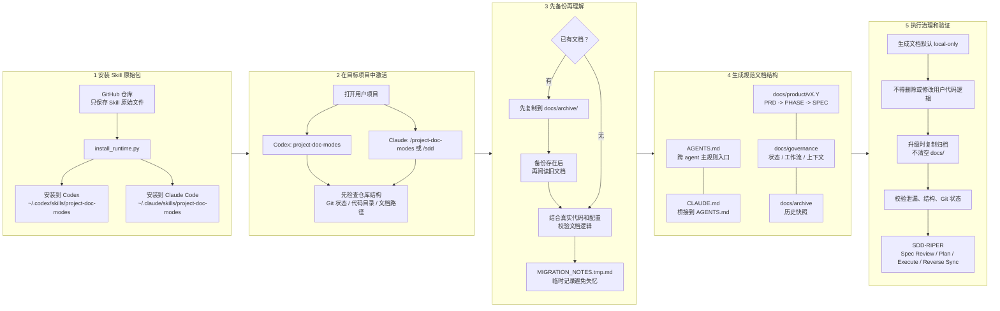

# project-doc-modes

`project-doc-modes` 是一个 Markdown-first 的文档治理 Skill。GitHub 仓库只保存 Skill 原始包；用户安装后，只有在自己的目标项目中激活这个 Skill，才会生成该项目自己的 `AGENTS.md`、`CLAUDE.md`、`README.md` 和 `docs/` 文档结构。

## 配图



## 安装

Codex:

```bash
python3 scripts/install_runtime.py ~/.codex/skills/project-doc-modes --runtime codex --force
```

Claude Code:

```bash
python3 scripts/install_runtime.py ~/.claude/skills/project-doc-modes --runtime claude --force
```

Claude Code 安装后会额外生成用户级命令：

```text
~/.claude/commands/project-doc-modes.md
~/.claude/commands/sdd.md
```

安装自测：

```bash
python3 scripts/install_runtime.py --self-test
```

GitHub 上的 Skill 原始包只包含：

```text
.gitignore
README.md
SKILL.md
agents/openai.yaml
references/rules.md
scripts/install_runtime.py
```

## 使用

在目标项目中打开 Codex，然后激活 `project-doc-modes` Skill。

在 Claude Code 中进入目标项目后使用：

```text
/project-doc-modes
```

如需启用 SDD-RIPER / 团队氛围编码治理，使用：

```text
/sdd
```

激活后，Skill 会先检查目标项目，再用少量问题确认模式、语言、版本、阶段或角色边界，然后才创建或迁移文档。

## 项目结构

初始化后的目标项目文档结构通常是：

```text
.
├── AGENTS.md
├── CLAUDE.md
├── README.md
└── docs/
    ├── README.md
    ├── archive/
    ├── governance/
    │   ├── STATUS.md
    │   ├── WORKFLOW.md
    │   ├── RELEASES.md
    │   └── context/
    │       ├── CODEMAP.md
    │       ├── CONTEXT_BUNDLE.md
    │       └── MIGRATION_NOTES.tmp.md
    └── product/
        ├── CURRENT.md
        └── v0.1/
            ├── README.md
            ├── requirements/
            ├── phases/
            │   └── PHASE-*/
            │       ├── PLAN.md
            │       ├── REVIEW.md
            │       ├── IMPLEMENTATION_RECORD.md
            │       └── specs/
            └── decisions/
```

协作模式会使用 `docs/collaboration/` 管理角色、边界、状态和交接文档。迭代模式会使用 `docs/product/vX.Y/` 管理版本化产品文档。SDD-RIPER 可以叠加在任一模式上。

## 工作流程

1. 安装 Skill 到 Codex 或 Claude Code。
2. 在目标项目中激活 Skill。
3. 检查仓库结构、Git 状态、代码目录、配置文件和已有文档路径。
4. 如果已有文档，先复制一份到 `docs/archive/`，再阅读和理解文档内容。
5. 结合真实代码和配置校验旧文档是否准确，记录不一致之处。
6. 确认使用协作模式或迭代模式，以及语言、版本、阶段或角色边界。
7. 按规范生成 `AGENTS.md`、`CLAUDE.md`、`README.md` 和分类 `docs/`。
8. 运行结构、泄漏、Git local-only、代码不可变等验证。

## 规范逻辑和约束

- GitHub 仓库是 Skill 原始包，不是目标项目初始化后的文档结构。
- 目标项目文档只在用户激活 Skill 后生成。
- 生成文档默认不进入 Git；除非用户明确要求，否则不得 `git add`、`git commit` 或 `git push`。
- 除 `AGENTS.md`、`CLAUDE.md`、`README.md` 外，其他生成的 Markdown 默认放在 `docs/` 下。
- `AGENTS.md` 是跨 agent 的主治理入口；`CLAUDE.md` 必须桥接到 `AGENTS.md`，不能另起一套规则。
- 需求、阶段、规格必须遵循 `PRD -> PHASE -> SPEC`：先需求方案，再 PHASE 规划，最后把 SPEC 拆到对应 PHASE 下。
- 不得删除、移动、重写或重构用户代码、配置、运行逻辑、API、依赖、测试，除非用户明确要求代码变更。
- 如果目标项目已有文档，必须先备份，再阅读、理解、迁移和重写。
- 文档升级时默认复制当前版本到 `docs/archive/`，然后升级当前文档；不得默认清空 `docs/`。
- 上一个版本的功能逻辑默认锁定为历史基线，除非用户明确要求修改。
- 生成的目标项目文档不得写入 `project-doc-modes`、`/project-doc-modes`、`/sdd`、`SKILL.md` 或本机安装路径。
- 复杂迁移可使用 `docs/governance/context/MIGRATION_NOTES.tmp.md` 做临时记录，避免迁移过程中丢失上下文。
